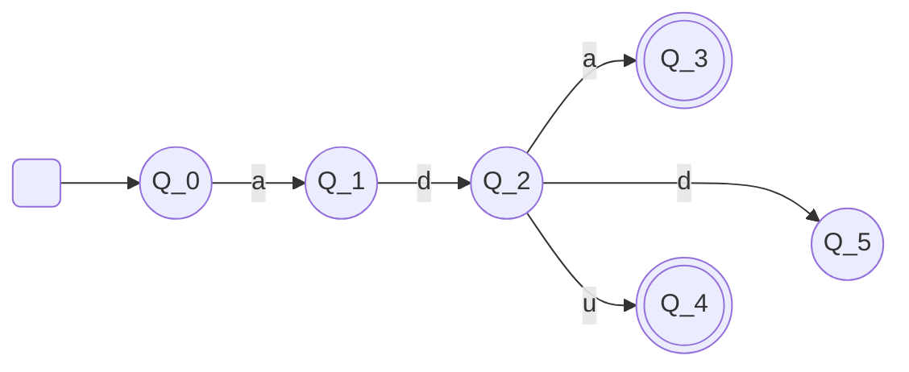

<h1 style="font-size: 28px"> Teori Bahasa dan Automata </h1>

<h2 style="margin-bottom: 5px; border-bottom: 2px solid grey; display: inline-block; width: 100%"># Introduction</h2>

[>\_] Ada beberapa <u>tingkatan bahasa Pemrograman</u>, antara lain:
- Bahasa tingkat rendah &nbsp;&nbsp;  -> Bahasa Mesin
- Bahasa tingkat menengah &nbsp;-> Bahasa Assembly
- Bahasa tingkat tinggi &nbsp;&nbsp; -> Bahasa java, Python, PHP, dll

[>\_] Lalu, <u>bagaimana sebuah mesin dapat memahami kode program yang dibuat oleh programmer</u>?

>	Sebuah mesin yang hanya mengenali bahasa mesin dapat memahami bahasa pemrograman tingkat tinggi karena adanya Compiler (kompilator/penerjemah)

<b>Teori Bahasa dan Automata adalah dasar dari teknik Kompilasi</b>

[>_] Apa yang dimaksud Teori Bahasa dan Automata?
- Automata adalah mesin abstrak yang dapat mengenali (recognize), menerima (accept), atau membangkitkan  (generate) sebuah kalimat dalam bahasa tertentu.
- Input pada mesin automata dianggap sebagai bahasa yang harus dikenali oleh mesin.
- Mesin akan mengindikasikan apakah suatu bahasa dapat diterima atau tidak.

[>\_] Mesin automata sederhana

- 6 state {q0, q1, q2, q3, q4, q5}
- Initial state {q0}
- Final state {q3, q4}
- Simbol input {a, d, u}

Note:
- String input diterima jika mencapai final state, selain itu ditolak
- Pembacaan simbol pertama dimulai dari initial state
- Perpindahan state berdasarkan simbol yang dibaca

Input String:
- ada = diterima
- adu = diterima
- add = ditolak

<h2 style="margin-bottom: 5px; border-bottom: 2px solid grey; display: inline-block; width: 100%"># Simbol, String, dan Bahasa</h2>

[>\_] Apa itu simbol?
>	Suatu entitas abstrak yang tidak didefinisikan secara formal
>	- Bayangkan sapi
>	- Definisi "1" atau "A"

[>\_] Apa itu string?
>	String/kata/untai merupakan suatu deretan berhingga dari simbol-simbol

<table>
<tr>
	<td>
<u>a</u>
</td>
	<td>
<u>abcd</u>
</td>
</tr>
<tr>
	<td>Simbol</td>
	<td>String</td>
</tr>
</table>

>	Beberapa simbol yang membentuk string tersebut

W = <u>abbac</u>  
|W| = 5

Bagaimana dengan sebuah string kosong?
>	Sebuah string kosong biasanya dinyatakan dengan simbol epsilon
>	Panjangnya = 0 

$$\epsilon$$

[>\_] Apa itu bahasa?
>	Suatu sistem yang meliputi pengekspresian gagasan, fakta, konse, termasuk sekumpulan simbol-simbol dan aturan untuk melakukan manipulasinya

>	Alphabet adalah himpunan berhingga dari symbol-symbol

>	Sebuah bahasa adalah himpunan string-string dari simbol-simbol untuk suatu alphabet
>>	Karena sebuah bahasa adalah sekumpulan dari string-string. Maka kita bisa mempunyai bahasa yang tidak mempunyai string-string, yaitu bahasa kosong yang dinotasikan seperti menuliskann notasi himpunan kosong

>	Bahasa juga bisa disebut sebagai rangkaian simbol-simbol yang memiliki makna

- Input pada mesin automata dianggap sebagai bahasa yang harus dikenali oleh mesin
- Mesin akan mengindikasikan apakah suatu bahasa dapat diterima atau tidak

<h2 style="margin-bottom: 5px; border-bottom: 2px solid grey; display: inline-block; width: 100%"># Tata Bahasa Hirarki Chomsky dan Aturan Produksi</h2>

[>\_] Simbol Terminal dan Non-Terminal

<b> &nbsp; > Apa itu symbol terminal?</b>
>	Symbol yang tidak dapat diturunkan lagi

&nbsp; Yang termasuk symbol terminal
- Huruf kecil alfabet, misalnya: a. b, c
- Simbol operator, misalnya: +, -, dan \*
- Simbol tanda baca, misalnya: (), dan ;
- String yang tercetak tebal, misanya: **if**, **then**, dan **else**

<b> &nbsp; > Apa itu symbol non-terminal?</b>
>	Symbol yang masih bisa diturunkan menjadi symbol Terminal atau Non-terminal lainnya

&nbsp; Yang termasuk symbol non-terminal
- Huruf besar alfabet, misalnya: A, B, C
- Huruf S sebagai symbol awal
- String yang tercetak miring. Misalnya: *expr* dan *stmt*

[>\_] Aturan Produksi

Aturan produksi dinyatakan dalam:

| | | |
|-|-|-|
| Alpha menyatakan symbol-symbol pada ruas kiri aturan produksi| $$\displaystyle \alpha \rightarrow \beta$$ | Beta Menyatakan symbol-symbol pada ruas kanan aturan produksi|
| | | |

Dibaca alpha menurunkan beta atau alpha menghasilkan beta Simbol dapat berupa symbol terminal atau non-terminal

- Dengan menerapkan aturan produksi, suatu tata bahasa bisa menghasilkan sejumlah string
- Himpunan semua string tersebbut adalah bahasa yang didefinisikan oleh tata bahasa tersebut

Contoh aturan produksi
$$\displaystyle T \rightarrow a$$
$$\displaystyle E \rightarrow T~|~T + E$$

[>\_] Hirarki Chomsky

>	Hirarki Chomsky merupakan pembagian tingkatan bahasa yang dibatasi oleh aturan produksi masing-masing

>	Noam Chomsky membagi tingkatan bahasa menjadi 4

&nbsp; 4 Tingkatan tata Bahasa menurut Chomsky
- Tipe 0 - Unrestricted Grammar (Bahasa Unrestricted)
- Tipe 1 - Context Sensitive Grammar (Bahasa Context Sensitive)
- Tipe 2 - Context Free Grammar (Bahasa Bebas Konteks)
- Tipe 3 - Regular Grammar (Bahasa Reguler)

<b> &nbsp; > Bahasa Unrestricted</b>

\[WORK IN PROGRESS\]

