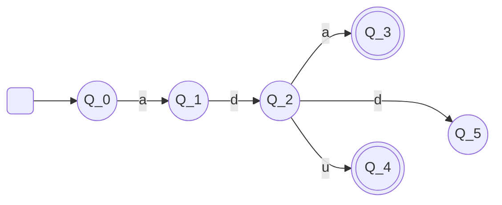

<h1 style="font-size: 28px"> Teori Bahasa dan Automata </h1>

<h2 style="border-bottom: 2px solid grey; display: inline-block; width: 100%"># Introduction</h2>

[>\_] Ada beberapa <u>tingkatan bahasa Pemrograman</u>, antara lain:
- Bahasa tingkat rendah &nbsp;&nbsp;  -> Bahasa Mesin
- Bahasa tingkat menengah &nbsp;-> Bahasa Assembly
- Bahasa tingkat tinggi &nbsp;&nbsp; -> Bahasa java, Python, PHP, dll

[>\_] Lalu, <u>bagaimana sebuah mesin dapat memahami kode program yang dibuat oleh programmer</u>?

>	Sebuah mesin yang hanya mengenali bahasa mesin dapat memahami bahasa pemrograman tingkat tinggi karena adanya Compiler (kompilator/penerjemah)

<b>Teori Bahasa dan Automata adalah dasar dari teknik Kompilasi</b>

[>_] Apa yang dimaksud Teori Bahasa dan Automata?
- Automata adalah mesin abstrak yang dapat mengenali (recognize), menerima (accept), atau membangkitkan  (generate) sebuah kalimat dalam bahasa tertentu.
- Input pada mesin automata dianggap sebagai bahasa yang harus dikenali oleh mesin.
- Mesin akan mengindikasikan apakah suatu bahasa dapat diterima atau tidak.

[>\_] Mesin automata sederhana

- 6 state {q0, q1, q2, q3, q4, q5}
- Initial state {q0}
- Final state {q3, q4}
- Simbol input {a, d, u}

Note:
- String input diterima jika mencapai final state, selain itu ditolak
- Pembacaan simbol pertama dimulai dari initial state
- Perpindahan state berdasarkan simbol yang dibaca

```mermaid
%%{init: {'theme':'light', 'themeCSS': 'svg {background-color: black}'}}%%
flowchart LR
	x() --> 0((Q_0)) -- a --> 1((Q_1)) -- d --> 2((Q_2)) -- a --> 3(((Q_3)))
	2 -- d --> 5((Q_5))
	2 -- u --> 4(((Q_4)))
	4 ~~~ 5
```
Input String:
- ada = diterima
- adu = diterima
- add = ditolak

<h2 style="border-bottom: 2px solid grey; display: inline-block; width: 100%"># Simbol, String, dan Bahasa</h2>

[>\_] Apa itu simbol?

>	Suatu entitas abstrak yang tidak didefinisikan secara formal
>	- Bayangkan sapi
>	- Definisi "1" atau "A"

[>\_] Apa itu string?
>	String/kata/untai merupakan suatu deretan berhingga dari simbol-simbol

<center>
<table>
<tr>
	<td><center><u>a</u></center></td>
	<td><center><u>abcd</u></center></td>
</tr>
<tr>
	<td>Simbol</td>
	<td>String</td>
</tr>
</table>
</center>

```latex
\documentclass{article}
\usepackage{tikz}
\usetikzlibrary{automata, positioning}

\begin{document}
\begin{tikzpicture}
  \node[state, initial] (A) {State A};
  \node[state, right=of A] (B) {State B};

  \path[->] (A) edge [bend left] node {Transition 1} (B);
  \path[->] (B) edge [bend left] node {Transition 2} (A);
\end{tikzpicture}
\end{document}
```
