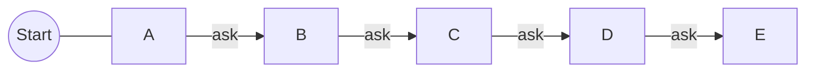
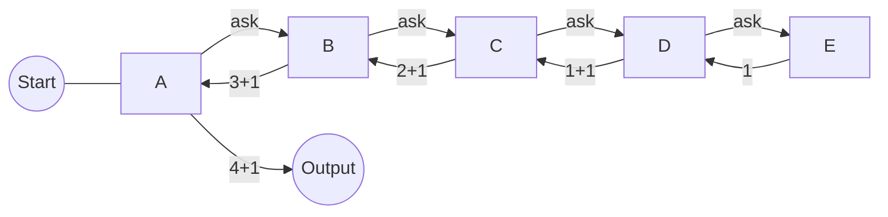
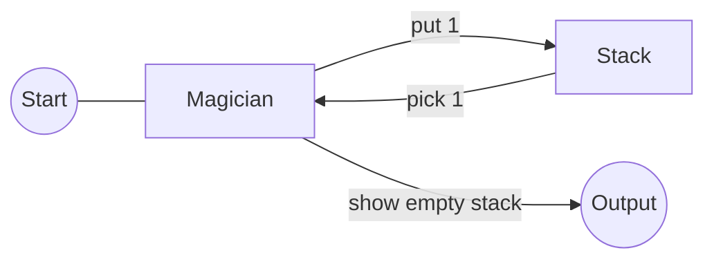
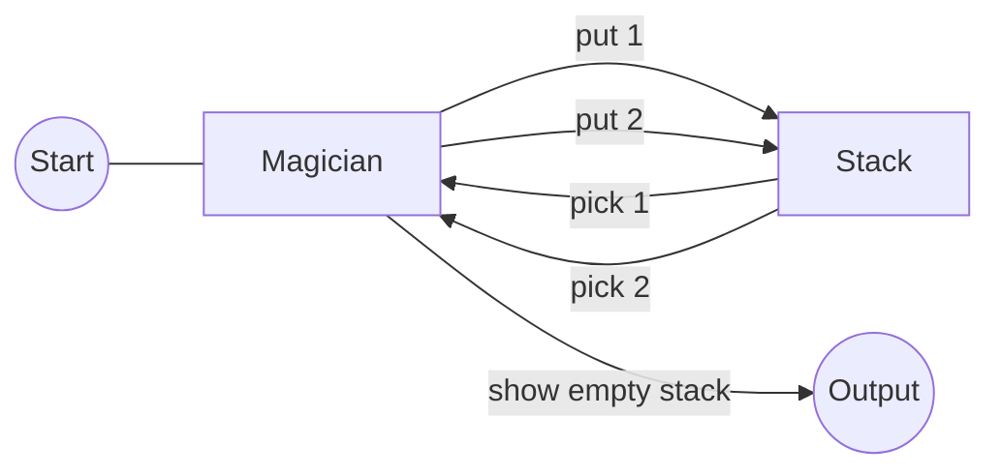
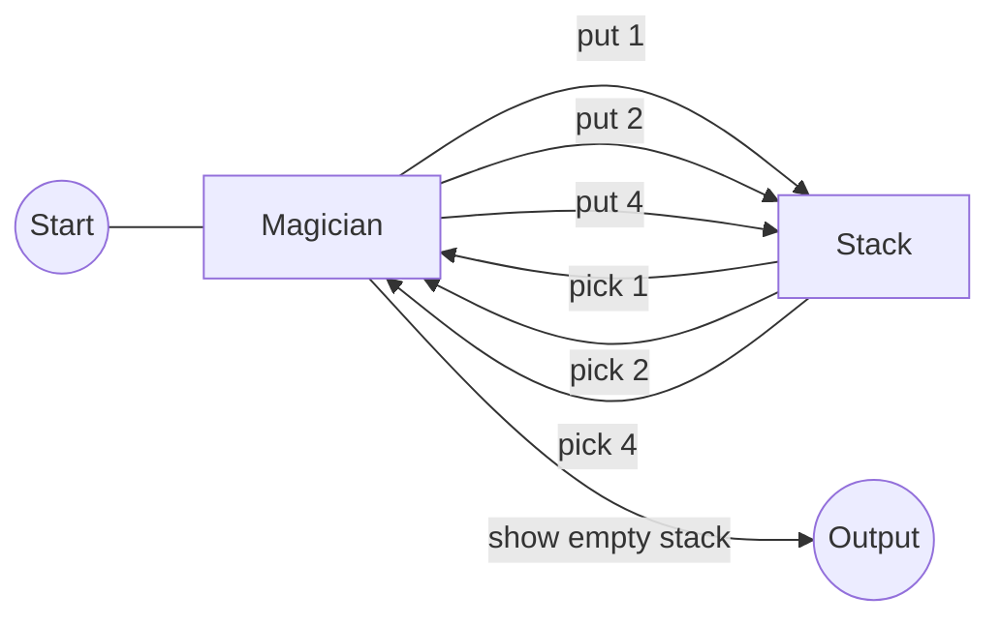

# Table of Content

- [Introduction](#introduction)
	- [Entry Analogy](#entry-analogy)
	- [Basic Syntax](#basic-syntax)
	- [Is it worth?](#is-it-worth)
	- [When to use it?](#when-to-use-it)
- [Call Stack](#call-stack)
	- [Magician Analogy](#magician-analogy)


# Introduction 
Secara umum, rekursi merupakan suatu fungsi atau prosedur yang memanggil dirinya sendiri sebagai bagian dari eksekusinya sendiri. Ini sering digunakan untuk menyelesaikan suatu masalah yang dimana masalah tersebut dapat dipecahkan dengan pendekatan pemecahan berulang.

Singkatnya, rekursi merupakan suatu metode dimana sebuah fungsi atau prosedur memanggil dirinya sendiri secara berulang-ulang untuk melakukan pendekatan pemecahan berulang dengan suatu kondisi tertentu pada suatu saat.

Pada dasarnya, ada dua elemen utama dalam rekursi:
1. Basis Rekursi (Base Case)
	> Ini adalah kondisi atau situasi yang menghentikan pemanggilan diri sendiri. Tanpa basis rekursi yang benar, rekursi akan berlanjut tanpa henti dan akhirnya menyebabkan error atau kegagalan program.
    
2. Langkah Rekursi (Recursive Step)
	> Ini adalah bagian dari fungsi atau prosedur yang memanggil dirinya sendiri. Pemanggilan rekursif ini harus mengarah pada perubahan yang terjadi pada masalah sehingga menuju basis rekursi. Dengan kata lain, masalah harus semakin kecil setiap kali fungsi dipanggil kembali.

## Entry Analogy 
Untuk memahami rekursi kita dapat menggunakan analogi nomor urut posisi.

Suatu ketika kamu mengantri pada suatu antrian panjang, namun dirimu tidak mengetahui nomor urutan posisimu saat ini. Maka dari itu kamu bertanya kepada orang yang berada di depanmu.

Orang di depanmu juga tidak mengetahui urutannya juga. Dirinya juga melakukan tindakan serupa seperti yang dirimu lakukan, yaitu bertanya kepada orang yang berada di depannya.

Orang di depannya juga melakukan tindakan serupa hingga pada urutan posisi pertama.
<br>



Setelah sampai pada orang di urutan posisi pertama, orang tersebut memberikan sebuah jawaban bahwa dirinya berada pada posisi pertama.

Orang yang menerima jawaban tersebut akan memberikan jawaban kepada orang sebelumnya juga yang dimana jawaban tersebut akan selalu meningkat, yaitu bertambah 1 setiap kali seseorang memberikan jawaban.

Ketika kamu telah menerima jawaban maka kamu dapat memberikan kesimpulan akhir tentang nomor urutan posisimu saat ini.
<br>


<br>

## Basic Syntax 
```pseudocode
// Pseudocode
function rekursi(parameter):
    // Basis rekursi
    if kondisi basis rekursi:
        return nilai basis
	else:
	    // Langkah rekursi
	    return pemanggilan diri sendiri(dengan argumen yang lebih kecil)

// Contoh penggunaan rekursi
ans = rekursi(nilai_parameter)
```
Note: banyak jenis sintaks dasar pada rekursi, namun secara umum pasti akan terdapat bagian sebagai basis rekursi dan langkah rekursi untuk memanggil dirinya sendiri. 

<br>

## Is it worth? 
Itu tergantung pada situasi dan kondisi pasa masalah yang sedang kamu hadapi. Namun ketika sedang menggunakannya terdapat kelebihan dan kekurangannya.

<center>
<table>
	<tr> 
		<th><center>Pros</center></th>
		<th><center>Cons</center></th>
	</tr>
	<tr> 
		<td>Menjembatani kesenjangan antara keanggunan dan kompleksitas</td>
		<td>Kelambatan karena overhead CPU</td>
	</tr>
	<tr> 
		<td>Mengurangi kebutuhan akan loop kompleks dan struktur data tambahan</td>
		<td>Dapat menyebabkan kesalahan kehabisan memori/pengecualian stack overflow</td>
	</tr>
	<tr> 
		<td>Dapat mengurangi kompleksitas waktu dengan mudah dengan memoisasi</td>
		<td>Bisa menjadi rumit jika dibangun dengan buruk</td>
	</tr>
	<tr> 
		<td>Bekerja sangat baik dengan struktur rekursif seperti pohon dan grafik</td>
		<td></td>
	</tr>
</table>
</center>

## When To Use It? 
Ada beberapa kondisi atau kriteria untuk mengimplementasikan rekursi secara tepat, yaitu
1. Masalah dapat dipecahkan menjadi masalah yang lebih kecil dengan struktur serupa
	> Rekursi efektif digunakan ketika masalah yang sedang dihadapi dapat dibagi menjadi beberapa kasus yang serupa dengan masalah utama. Pemecahan masalah tersebut kemudian dapat diteruskan ke fungsi rekursif yang sama.
    
2. Solusi rekursif lebih mudah dimengerti
	> Terkadang, solusi rekursif lebih mudah dimengerti daripada solusi iteratif atau non-rekursif. Terutama dalam masalah matematis atau algoritma dengan karakteristik yang mengikuti pola rekursif, rekursi dapat memperjelas logika pemecahan masalah.
    
3. Kasus dasar atau basis rekursi jelas
	> Anda harus memiliki pemahaman yang jelas tentang kapan rekursi harus berhenti. Basis rekursi adalah kondisi yang memicu penghentian rekursi. Tanpa basis rekursi yang benar, rekursi akan terus berlanjut dan menyebabkan stack overflow atau masalah serupa.
    
4. Rekursi lebih efisien daripada alternatifnya
	> Ada situasi di mana rekursi dapat menghasilkan solusi yang lebih efisien daripada pendekatan non-rekursif. Contoh terkenal adalah algoritma pembagi dan penaklukan (divide and conquer) seperti pengurutan cepat (quick sort) atau pembagian nilai (merge sort).
    
5. Membutuhkan kode yang lebih sederhana
	> Kadang-kadang, rekursi dapat menghasilkan kode yang lebih sederhana dan mudah dibaca daripada pendekatan iteratif yang berbelit-belit.
    
6. Ingin menghindari penumpukan variabel dalam iterasi
	> Rekursi dapat menghindari masalah penumpukan variabel yang mungkin terjadi dalam pengulangan. Ini bisa berguna dalam beberapa kasus.
    
7. Ingin mengimplementasikan algoritma dengan struktur berulang
	> Beberapa algoritma seperti pencarian dalam struktur data berulang seperti pohon atau graf lebih mudah diimplementasikan secara rekursif.
	
Perlu diingat bahwa harus hati-hati dalam penggunaan rekursi, karena rekursi dapat menjadi sulit untuk di-debug dan dapat menyebabkan masalah jika tidak dikelola dengan benar. Selalu pastikan bahwa basis rekursi tercapai dan rekursi berhenti pada suatu titik untuk mencegah masalah "stack overflow" dan kinerja yang buruk.

# Call-Stack
Call stack (tumpukan panggilan) adalah salah satu konsep penting dalam pemrograman komputer, terutama dalam pemrograman berbasis fungsi atau pemrograman prosedural. Call-Stack merupakan struktur data yang digunakan untuk melacak eksekusi fungsi atau metode dalam sebuah program. Call stack mengikuti urutan panggilan fungsi dan mengatur bagaimana fungsi-fungsi tersebut saling memanggil dan kembali.

Call stack bekerja dengan cara berikut:

1. Ketika program dimulai, satu fungsi utama (biasanya disebut "main" atau "entry point") dimasukkan ke dalam call stack.

2. Ketika fungsi lain dipanggil dari fungsi utama, fungsi tersebut ditambahkan ke atas call stack.

3. Call stack selalu memegang informasi tentang fungsi yang sedang aktif (yang berada di puncak tumpukan). Fungsi ini adalah fungsi yang saat ini sedang dieksekusi.

4. Ketika fungsi selesai dieksekusi, ia dihapus dari call stack, dan eksekusi kembali ke fungsi yang memanggilnya (fungsi pemanggil).

5. Proses ini berlanjut hingga semua fungsi yang telah dipanggil selesai dieksekusi, dan call stack kembali kosong.

Call stack sangat penting untuk menghindari kesalahan eksekusi dan mengelola pemanggilan fungsi yang bersarang (nested function calls). Ketika call stack menjadi terlalu dalam (biasa disebut "stack overflow"), itu dapat mengakibatkan kesalahan dan penghentian program.

Selain itu, call stack juga digunakan dalam bahasa pemrograman yang mendukung rekursi, di mana sebuah fungsi memanggil dirinya sendiri. Call stack melacak semua panggilan rekursif sehingga program tahu kapan harus kembali dari panggilan rekursif dan melanjutkan eksekusi.

## Magician Analogy
Untuk memahami call stack kita bisa membayangkan call stack sebagai cerita sederhana tentang seorang pesulap yang mengadakan pertunjukan sulap di panggung. Pesulap ini adalah fungsi utama dalam cerita kita, dan panggung adalah call stack.

Ceritanya dimulai dengan pesulap berdiri sendirian di atas panggung (call stack kosong) dan dia memiliki seutas tali yang panjang. Setiap kali pesulap melakukan trik sulap, dia menambahkan tali ke dalam tumpukan tali di tangannya.

1. Trik Pertama:
   - Pesulap memasukkan satu ujung tali ke dalam tumpukan (call stack).
   - Dia melakukan trik sulap pertamanya (memasukkan tali dengan panjang kelipatan dua dari sebuah angka, dimulai dari 1).
   - Ketika trik selesai, pesulap mengeluarkan ujung tali dari tumpukan (call stack kosong lagi).


2. Trik Kedua:
   - Pesulap memasukkan satu ujung tali lagi ke dalam tumpukan (call stack).
   - Dia melakukan trik sulap kedua (mengalikan dua angka pada panjang sebelumnya di percobaan keduanya).
   - Setelah itu, dia mengeluarkan ujung tali dari tumpukan lagi.


3. Trik Ketiga:
   - Kali ini, pesulap memutuskan untuk melakukan trik yang lebih rumit. Dia memasukkan ujung tali lagi ke dalam tumpukan.
   - Dalam trik ini, pesulap memanggil dirinya sendiri untuk melakukan trik sulap (rekursi). Setiap kali dia memanggil dirinya sendiri, dia menambahkan tali yang lebih panjang ke tumpukan.
   - Ketika trik ini akhirnya selesai, pesulap mengeluarkan tali-tali satu per satu sampai tumpukan kosong lagi.



Selama pertunjukan, penyihir terus menambahkan tali ke dalam tumpukan (call stack) setiap kali dia memulai trik sulap, dan dia mengeluarkan tali dari tumpukan ketika trik selesai. Setiap kali tumpukan tali terlalu panjang, penyihir harus mengeluarkan tali-tali tersebut sebelum bisa melanjutkan pertunjukan.

Dalam analogi ini, panggung (call stack) selalu memiliki tumpukan tali (fungsi yang aktif), dan penyihir (program) bermain-main dengan tali-tali ini saat dia melakukan trik sulap (eksekusi kode). Ini adalah cara yang sederhana untuk memahami bagaimana call stack bekerja dalam pemrograman.