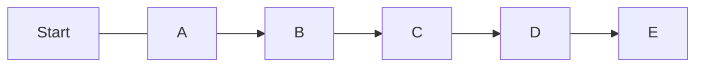
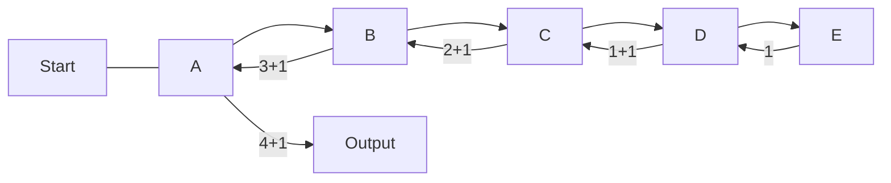

# Introduce
Secara umum, rekursi merupakan suatu fungsi atau prosedur yang memanggil dirinya sendiri sebagai bagian dari eksekusinya sendiri. Ini sering digunakan untuk menyelesaikan suatu masalah yang dimana masalah tersebut dapat dipecahkan dengan pendekatan pemecahan berulang.

Singkatnya, rekursi merupakan suatu metode dimana sebuah fungsi atau prosedur memanggil dirinya sendiri secara berulang-ulang untuk melakukan pendekatan pemecahan berulang dengan suatu kondisi tertentu pada suatu saat.

# Entry Analogy
Untuk memahami rekursi kita dapat menggunakan analogi nomor urut posisi.

Suatu ketika kamu mengantri pada suatu antrian panjang, namun dirimu tidak mengetahui nomor urutan posisimu saat ini. Maka dari itu kamu bertanya kepada orang yang berada di depanmu.

Orang di depanmu juga tidak mengetahui urutannya juga. Dirinya juga melakukan tindakan serupa seperti yang dirimu lakukan, yaitu bertanya kepada orang yang berada di depannya.

Orang di depannya juga melakukan tindakan serupa hingga pada urutan posisi pertama.
<br>



Setelah sampai pada orang di urutan posisi pertama, orang tersebut memberikan sebuah jawaban bahwa dirinya berada pada posisi pertama.

Orang yang menerima jawaban tersebut akan memberikan jawaban kepada orang sebelumnya juga yang dimana jawaban tersebut akan selalu meningkat, yaitu bertambah 1 setiap kali seseorang memberikan jawaban.

Ketika kamu telah menerima jawaban maka kamu dapat memberikan kesimpulan akhir tentang nomor urutan posisimu saat ini.
<br>


<br>

# Basic Syntax
```pseudocode
// Pseudocode
function rekursi(parameter):
    // Basis rekursi
    if kondisi basis rekursi:
        return nilai basis
	else:
	    // Langkah rekursi
	    return pemanggilan diri sendiri(dengan argumen yang lebih kecil)

// Contoh penggunaan rekursi
ans = rekursi(nilai_parameter)

```