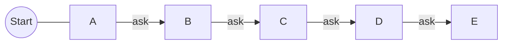
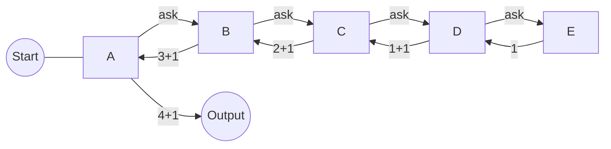

# Introduce
Secara umum, rekursi merupakan suatu fungsi atau prosedur yang memanggil dirinya sendiri sebagai bagian dari eksekusinya sendiri. Ini sering digunakan untuk menyelesaikan suatu masalah yang dimana masalah tersebut dapat dipecahkan dengan pendekatan pemecahan berulang.

Singkatnya, rekursi merupakan suatu metode dimana sebuah fungsi atau prosedur memanggil dirinya sendiri secara berulang-ulang untuk melakukan pendekatan pemecahan berulang dengan suatu kondisi tertentu pada suatu saat.

# Entry Analogy
Untuk memahami rekursi kita dapat menggunakan analogi nomor urut posisi.

Suatu ketika kamu mengantri pada suatu antrian panjang, namun dirimu tidak mengetahui nomor urutan posisimu saat ini. Maka dari itu kamu bertanya kepada orang yang berada di depanmu.

Orang di depanmu juga tidak mengetahui urutannya juga. Dirinya juga melakukan tindakan serupa seperti yang dirimu lakukan, yaitu bertanya kepada orang yang berada di depannya.

Orang di depannya juga melakukan tindakan serupa hingga pada urutan posisi pertama.
<br>



Setelah sampai pada orang di urutan posisi pertama, orang tersebut memberikan sebuah jawaban bahwa dirinya berada pada posisi pertama.

Orang yang menerima jawaban tersebut akan memberikan jawaban kepada orang sebelumnya juga yang dimana jawaban tersebut akan selalu meningkat, yaitu bertambah 1 setiap kali seseorang memberikan jawaban.

Ketika kamu telah menerima jawaban maka kamu dapat memberikan kesimpulan akhir tentang nomor urutan posisimu saat ini.
<br>


<br>

# Basic Syntax
```pseudocode
// Pseudocode
function rekursi(parameter):
    // Basis rekursi
    if kondisi basis rekursi:
        return nilai basis
	else:
	    // Langkah rekursi
	    return pemanggilan diri sendiri(dengan argumen yang lebih kecil)

// Contoh penggunaan rekursi
ans = rekursi(nilai_parameter)

```
Note: banyak jenis sintaks dasar pada rekursi, namun secara umum pasti akan terdapat bagian sebagai basis rekursi dan langkah rekursi untuk memanggil dirinya sendiri. 

<br>

# Is it worth?
Itu tergantung pada situasi dan kondisi yang sedang kamu hadapi. Namun ketika sedang menggunakannya terdapat kelebihan dan kekurangannya.

<center>
<table>
	<tr> 
		<th><center>Pros</center></th>
		<th><center>Cons</center></th>
	</tr>
	<tr> 
		<td>Menjembatani kesenjangan antara keanggunan dan kompleksitas</td>
		<td>Kelambatan karena overhead CPU</td>
	</tr>
	<tr> 
		<td>Mengurangi kebutuhan akan loop kompleks dan struktur data tambahan</td>
		<td>Dapat menyebabkan kesalahan kehabisan memori/pengecualian stack overflow</td>
	</tr>
	<tr> 
		<td>Dapat mengurangi kompleksitas waktu dengan mudah dengan memoisasi</td>
		<td>Bisa menjadi rumit jika dibangun dengan buruk</td>
	</tr>
	<tr> 
		<td>Bekerja sangat baik dengan struktur rekursif seperti pohon dan grafik</td>
		<td></td>
	</tr>
</table>
</center>

# When To Use It?
Ada beberapa kondisi atau kriteria untuk mengimplementasikan rekursi secara tepat, yaitu
1. Masalah dapat dipecahkan menjadi masalah yang lebih kecil dengan struktur serupa
	> Rekursi efektif digunakan ketika masalah yang sedang dihadapi dapat dibagi menjadi beberapa kasus yang serupa dengan masalah utama. Pemecahan masalah tersebut kemudian dapat diteruskan ke fungsi rekursif yang sama.
    
2. Solusi rekursif lebih mudah dimengerti
	> Terkadang, solusi rekursif lebih mudah dimengerti daripada solusi iteratif atau non-rekursif. Terutama dalam masalah matematis atau algoritma dengan karakteristik yang mengikuti pola rekursif, rekursi dapat memperjelas logika pemecahan masalah.
    
3. Kasus dasar atau basis rekursi jelas
	> Anda harus memiliki pemahaman yang jelas tentang kapan rekursi harus berhenti. Basis rekursi adalah kondisi yang memicu penghentian rekursi. Tanpa basis rekursi yang benar, rekursi akan terus berlanjut dan menyebabkan stack overflow atau masalah serupa.
    
4. Rekursi lebih efisien daripada alternatifnya
	> Ada situasi di mana rekursi dapat menghasilkan solusi yang lebih efisien daripada pendekatan non-rekursif. Contoh terkenal adalah algoritma pembagi dan penaklukan (divide and conquer) seperti pengurutan cepat (quick sort) atau pembagian nilai (merge sort).
    
5. Membutuhkan kode yang lebih sederhana
	> Kadang-kadang, rekursi dapat menghasilkan kode yang lebih sederhana dan mudah dibaca daripada pendekatan iteratif yang berbelit-belit.
    
6. Ingin menghindari penumpukan variabel dalam iterasi
	> Rekursi dapat menghindari masalah penumpukan variabel yang mungkin terjadi dalam pengulangan. Ini bisa berguna dalam beberapa kasus.
    
7. Ingin mengimplementasikan algoritma dengan struktur berulang
	> Beberapa algoritma seperti pencarian dalam struktur data berulang seperti pohon atau graf lebih mudah diimplementasikan secara rekursif.
	
Perlu diingat bahwa harus hati-hati dalam penggunaan rekursi, karena rekursi dapat menjadi sulit untuk di-debug dan dapat menyebabkan masalah jika tidak dikelola dengan benar. Selalu pastikan bahwa basis rekursi tercapai dan rekursi berhenti pada suatu titik untuk mencegah masalah "stack overflow" dan kinerja yang buruk.