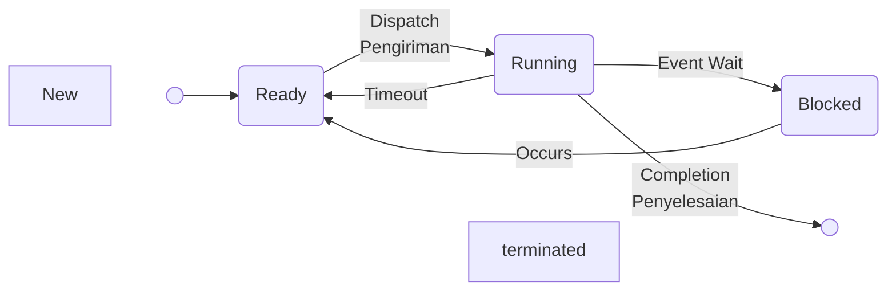

# Manajemen Proses

## Proses
- Program yang sedang di ekesekusi
- Proses merupakan unti kerja terkecil yang secara individu memiliki sumber daya dan merupakan unit terkecil yang dijadwal sitstem operasi
- Beberapa istilah penting berkaitan dengan proses:
	> - Multiprogramming (multitasknig)
	> - Multiprocessing
	> - Distributed processing

### Multiprogramming
- Manajemen banyak proses di satu pemroses
- Pada multiprogramming pemakai memandang terdapat banyak proses dijalankan bersamaan pada satu saat
- Proses yang dijalankan pada sistem multiprogramming bersifat: 
	> - Saling tidak bergantung
		-> Artinya proses tidak saling mempengaruhi satu sama lain
	> - Proses dihalankan bersamaan pada satu saat
- Dalam multiprogramming sistem melakukan interfeave (salingg mealanjutkan)
- Sehingga seolah-olah proses beroperasi secara bersamaan
- Pemroses mengeksekusi satu proses tiap saat dan secara cepat beralih ke proses lain secara bergiliran
- Karena dilakukan dengan sangat cepat sehingga menimbulkan efek pseudoparallelism pada pemakai
- Pseudoparallelism, adalah konsep

### Multiprocessing
- Manajemen banyak proses pada komputer multiprocessor (banyak pemroses)
- Awalnya hanya terdapat pada komputer besar mainframe (Serveer) dan minikomputer
- Dimaksudkan untuk peningkatan kinerja dan memberikan kemampuan fault tolerant
- Ex: Windows NT, UNIX, Linux

### Distributed Processing
- Manajemen banyak proses yang dieksekusi pada banyak sistem komputer yang tersebar pada jaringan
- ..... *belum selesai

## State Proses
- Proses melewati serangkaian state
- Berbagai kejadian dapat menyebabkanperubahan/perpindahan state proses
- Terbagi menjadi dua bagian state dasar (3 bagian) dan stat lanjut (5 bagian)

| Status | Deskripsi |
| :------ | :------- |
| Running | Pemroses sedang mengeksekusi i istruksi proses tsb |
| Ready | Proses siap dieksekusi tapi pemrose tidak mengeksekusi proses ini |
| Blocked | Proses menunggu kejadian tertentu selesai   Misal :   > Selesainya operasi I/O   > Tersedianya memory, dll |

 

 

- Terdapat transisi di antara state-state selama siklus proses, yaitu:
- Proses yang baru diciptakan akan segea mempunyai state <b>Ready</b>
- .... *belum selesai

## Process Control Block (PCB)
- Berfungsi untuk menyimpa informasi mengenai proses.
- Informasi di PCB dikelompokkan menjadi tiga kelompok, yaitu: 
	> 1. Informasi identifikasi proses   -> Berkaitan dengan identifikasi proses yang unik, iden .... *belum selesai banyak
